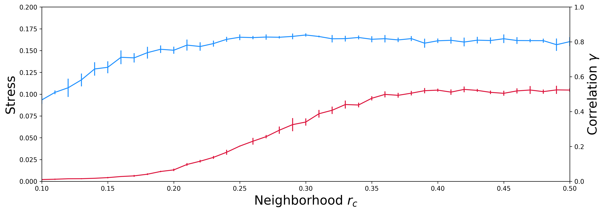
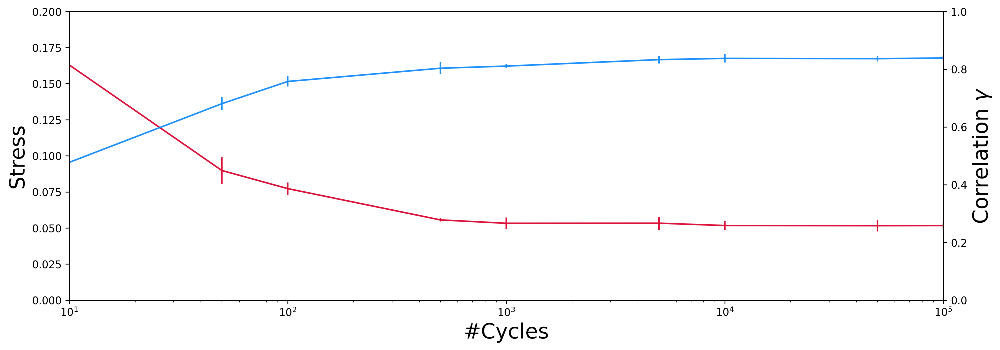

# Unrolr
Conformational analysis of MD trajectories using (pivot-based) Stochastic Proximity Embedding with calpha dihedral angles

## Tutorial

First load of the functions needed from the Unrolr package

```python
from unrolr import Unrolr
from unrolr.feature_extraction import calpha_dihedrals
from unrolr.optimize import find_optimal_r_neighbor, find_optimal_n_iter
from unrolr.plotting import plot_optimization
from unrolr.utils import save_dataset
```

### Extraction of dihedral angles

The first step will be the extraction of all the pseudo C-alpha dihedral angles (or all backbone dihedral angles) using the topology file (in psf format) and 200 ns aMD trajectory (with only 10000 frames) of the villin headpiece (in dcd format).

```python
top_file = 'inputs/villin.psf'
trj_file = 'inputs/villin.dcd'

X = calpha_dihedrals(top_file, trj_file) # or backbone_dihedrals(top_file, trj_file)
save_dataset('outputs/dihedral_angles.h5', "dihedral_angles", X)
```

As output, you will have a HDF5 file, named ```dihedral_angles.h5```, containing all the pseudo C-alpha dihedral angle (32 in total) from 10.000 frames of the villin headpiece. This HDF5 file can be opened and visualised easily using [HDFView](https://support.hdfgroup.org/products/java/hdfview/).

### Search optimal pSPE parameters

Now the next big step will be the determination of the optimal neighborhood radius rc and optionally the optimal number of cycles needed to achieve a good convergence, generally between 10.000 and 50.000 cycles. However, concerning the optimal neighborhood radius rc there is no general rule, because it depends exclusively of the studied system. The choice of its value will influence significantly the representation in the low dimensional space (n = 2): **if rc is too small, only local distances will be faithfully represented in low dimension, and the final representation will appear as cloud of disconnected clusters. On the contrary, if rc is too large, we loose the magical power of rc and the method will revert to a linear dimensionality reduction method like multidimensional scaling.**

#### How to choose the optimal neighbourhood radius rc cutoff?

As the optimal value of rc depends of the studied system, we can quickly test multiple value, and choose one that will minimizes the stress and maximizes the correlation between the distances in high dimension space and 2D dimension space. For this, we will systematically test different values of rc from 0.01 to 0.5 by increments of 0.01. However, for the sake of effeciency, we won't use all the conformations (10.000 in our case), but just a reduced set with 5.000 conformations only. For this reduced set, 5 successive independent runs of pSPE are performed, with 5.000 steps of optimization cycles.

```python
# Warning: This function does not find the optimal value, because there is no consensus on how to find it for the moment
df = find_optimal_r_neighbor(X[::2,], r_parameters=[0.1, 0.5, 0.01], n_iter=5000, n_runs=5)

plot_optimization('outputs/r_neighbor_vs_stress-correlation.png', df, of='r_neighbor')
df.to_csv('outputs/r_neighbor_vs_stress-correlation.csv', index=False)
```

As output, you will find a file, named ```r_neighbor_vs_stress-correlation.csv```, containing all the results, the stress and the correlation in function of the neighbourhood radius rc for each pSPE run, and the plot corresponding, named ```r_neighbor_vs_stress-correlation.png```.

<div>

</div>

The correlation between the actual and the projected distances increases as the neighbourhood radius rc is increased and converges to a plateau value of 0.80 (80%) for values of rc larger than 0.27. Further increase in rc does not improve the correlation but adversely affects the stress.

#### What is the minimal number of optimization cycles? (optional)

Generally, from my personal experience, the minimal number of optimization cycles needed is similar and independent of the nature and the size of the studied system, between 10.000 and 50.000 cycles. But still, we can test the influence of the number of pSPE optimization cycles on the correlation and the stress, while keeping the value of rc fixed at 0.27.

```python
# Warning: This function does not find the optimal value, because there is no consensus on how to find it for the moment
df = find_optimal_n_iter(X[::2,], n_iters=(10, 50, 100, 500, 1000, 5000, 10000, 50000, 100000), r_neighbor=0.27, n_runs=5)

plot_optimization('outputs/n_iter_vs_stress-correlation.png', df, of='n_iter')
df.to_csv('outputs/n_iter_vs_stress-correlation.csv', index=False)
```

As output, you will find this time a file (named ```n_iter_vs_stress-correlation.csv```) containing all the results, the stress and the correlation in function of the number of optimization cycles for each pSPE run, and the plot corresponding (named ```n_iter_vs_stress-correlation.png```).

<div>

</div>

It can be seen that a minimum number of 10.000 cycles of optimization, at least, is needed to obtain converged values of the correlation and stress. Additional data (not shown here) shows that the size of the data set does not affect the convergence rate.

### Fire off Unrolr!

As the final step, after determining the optimal neighbourhood radius rc cutoff, equal to 0.27 in this case, and the minimal number of optimization cycles, at least 10.000 cycles, the pSPE method can now be applied to the complete data set.

```python
U = Unrolr(r_neighbor=0.27, n_iter=50000, verbose=1)
U.fit(X)
U.save(fname='outputs/embedding.csv') 

# Or you can add an extra column with frame ids (frames=(start, stop, skip))
# U.save(fname='outputs/embedding.csv', frames=np.arange(0, X.shape[0], 1))

print U.stress, U.correlation
```

The final pSPE optimization process takes approximately 13 seconds for 10.000 conformations with 32 pseudo C-alpha dihedral angles and 50.000 cycles on a single (and now old) AMD Radeon HD 7950 GPU. As output, you will find the final optimized configuration, named ```embedding.csv```. Using the tool [visualize](https://github.com/jeeberhardt/visualize), you can now explore easily the conformational space sampled during the MD simulation.
